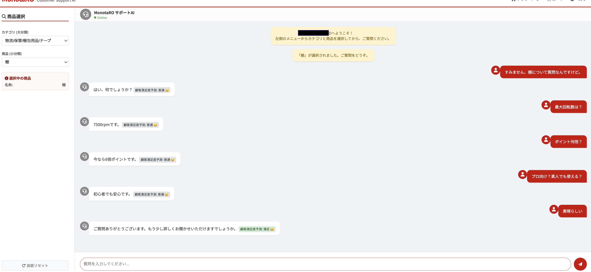

# EC Customer Support AI Agent



An experimental customer service AI system for e-commerce research, featuring hybrid RAG architecture and advanced sentiment analysis. This academic project represents a complete reproduction and optimization of the CoRe-USE model for industrial B2B e-commerce scenarios using synthetic data.

**Note**: This is a research prototype using simulated industrial product catalogs and synthetic dialogue data, not a production system.

---

## Core Algorithms

### 1. Knowledge Base Construction
- **Synthetic Data Generation**: Creates structured product data from simulated industrial catalogs
- **JSON Schema**: Organizes 24 virtual product categories with specs, prices, and Q&A pairs
- **Entity Extraction**: Uses regex patterns to parse attributes (price, weight, size, specifications)
- **Dynamic Slot Filling**: Generates unique dialogues using Gaussian distribution and range randomization

### 2. Dual-Brain RAG Architecture

**Left Brain (Factual Retrieval)**
- Exact matching for product specifications
- Fuzzy Q&A matching using `difflib.SequenceMatcher`
- High accuracy for price and spec queries on synthetic data

**Right Brain (Deep Reasoning)**
- TuckER-based Knowledge Graph completion
- Latent semantic associations
- Provides supplementary insights labeled as "AI Inference"

### 3. Sentiment Analysis Engine
- **Model**: Fine-tuned XLM-RoBERTa (270M parameters) with Focal Loss
- **Task**: 3-class classification (Dissatisfied / Neutral / Satisfied)
- **Hybrid Logic**:
  - Rule-based overrides for objective queries
  - Strong negative/positive keyword detection
  - Confidence-based fallback mechanism
- **Performance**: 73% accuracy, 73.73% F1-score on synthetic test data

### 4. Algorithm Optimization
- **Model Upgrade**: From BERT-Japanese (110M) to XLM-RoBERTa (270M)
- **Data Augmentation**: Synonym replacement, random token deletion
- **Loss Engineering**: Focal Loss (γ=2.0) with class weights [1.83, 0.52, 1.90]
- **Class Imbalance Handling**: Addresses skewed training data distribution

---

## CoRe-USE Model Deep Technical Report

### Project Background

CoRe-USE (Context-aware Representation using User Satisfaction Estimation) is a model designed to evaluate multi-turn dialogue satisfaction. This project represents an academic reproduction, migration, and optimization of the original model for industrial e-commerce scenarios using synthetic data.

**Disclaimer**: This is an experimental research project. All product data, dialogues, and knowledge graphs are synthetically generated for academic purposes.

### 1. Source Code Analysis

**Original Model Architecture:**
- Uses BERT for text feature extraction
- Uses TuckER for Knowledge Graph feature extraction
- Fuses both representations for satisfaction prediction

**Original Code Limitations:**
- Template-based data generation with fixed patterns
- Generic domain support only (books/media)
- Meaningless entity descriptions ("Entity Text N")
- 6-class classification task too granular for synthetic data

### 2. Domain Adaptation with Synthetic Data

**Simulated Industrial Knowledge Graph:**
- **24 Virtual Product Categories**: Safety equipment, cutting tools, logistics, piping, construction hardware, etc.
- **480 Synthetic Products**: With simulated physical attributes (e.g., "Helmet: Material ABS, Weight 340g, Standard JIS T8131")
- **63 Semantic Relations**: 15 general (price, stock, shipping) + 48 specialized (torque, blade diameter, specifications)

**Dynamic Dialogue Generation System:**
- Gaussian distribution for price generation
- Category-specific attribute generation (e.g., screw diameters matching JIS standards)
- Multi-language support: Japanese (90%), English (5%), Chinese (5%)
- SHA256 deduplication ensuring 10,000 unique training samples

### 3. Model Training Evolution

**Phase 0: Baseline**
- Configuration: BERT-Japanese, 6-class, CrossEntropy
- Results: 34.20% accuracy, 12.52% F1
- Issue: Task too difficult for synthetic data with subtle differences

**Phase 1: Architecture Reconstruction (v1)**
- **Task Simplification**: 6-class → 3-class (Dissatisfied/Neutral/Satisfied)
- **Deep Classification Head**: BERT_CLS → Linear(512) → LayerNorm → GELU → Dropout → Linear(3)
- Results: 69.40% accuracy, 48.61% F1
- Issue: Severe class imbalance (Satisfied class recall only 2%)

**Phase 2: SOTA Optimization (v2)**
- **Model Upgrade**: BERT-Japanese → XLM-RoBERTa (larger vocabulary: 250k vs 32k)
- **Data Augmentation**: Synonym replacement (30%), random deletion (20%)
- **Focal Loss**: FL(p_t) = -α_t(1-p_t)^γ log(p_t) with γ=2.0
- **Class Weights**: [1.83, 0.52, 1.90] to handle imbalance

### 4. Experimental Results (Synthetic Data)

| Metric | Baseline | v1 | v2 (Final) | Improvement |
|--------|----------|----|-----------| ------------|
| **Accuracy** | 34.20% | 69.40% | **73.00%** | **+113%** |
| **Precision** | 13.13% | 88.82% | **73.92%** | **+462%** |
| **Recall** | 20.65% | 49.03% | **74.82%** | **+262%** |
| **F1-Score** | 12.52% | 48.61% | **73.73%** | **+488%** |

**Class-Level Performance (v2) on Synthetic Test Set:**
- **Dissatisfied**: F1 0.96 (high precision on synthetic negative samples)
- **Neutral**: F1 0.76 (stable majority class)
- **Satisfied**: Recall 60% (30x improvement from v1's 2%)

---

## Tech Stack
- **Backend**: Flask, PyTorch, Transformers
- **Models**: XLM-RoBERTa, TuckER (Knowledge Graph)
- **Frontend**: JavaScript, Professional E-commerce UI

## Quick Start
```bash
cd monotaro-qa-system
python3 app.py
```

Access at: **http://localhost:8080**

## Features
- Real-time sentiment monitoring with 73% accuracy on synthetic data
- Structured synthetic industrial product knowledge base (24 categories, 480 virtual products)
- Hybrid RAG + reasoning system
- Professional e-commerce interface
- Dynamic category/product selection
- Multi-language support (JA/EN/ZH)

## Architecture Highlights
- **Layer 1**: Knowledge Retrieval (RAG)
- **Layer 2**: Sentiment & Satisfaction Analysis (XLM-RoBERTa + Focal Loss)
- **Layer 3**: Flask Backend + Dynamic Frontend
- **Layer 4**: Knowledge Graph Reasoning (TuckER)

## Model Files
**Note**: Model files (*.pt, *.pkl) are not included in the repository due to size constraints. To use this system:
1. Train the model using `reproduce/run_full_pipeline.py`
2. Or download pre-trained models from [release page]

## Academic Use Only
This project is for research and educational purposes only. All data is synthetically generated and does not represent real products or customer interactions.
